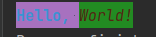
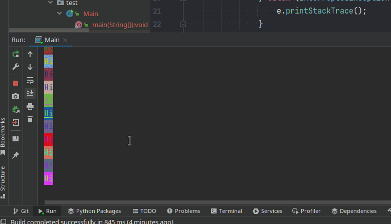

# JColorfulConsole is a console color library.

[](https://jitpack.io/#Anas-Elgarhy/JColorfulConsole)
[](https://sonarcloud.io/summary/new_code?id=Anas-Elgarhy_JColorfulConsole)
[](https://sonarcloud.io/summary/new_code?id=Anas-Elgarhy_JColorfulConsole)
[](https://sonarcloud.io/summary/new_code?id=Anas-Elgarhy_JColorfulConsole)
[](https://sonarcloud.io/summary/new_code?id=Anas-Elgarhy_JColorfulConsole)
[](https://sonarcloud.io/summary/new_code?id=Anas-Elgarhy_JColorfulConsole)
[](https://sonarcloud.io/summary/new_code?id=Anas-Elgarhy_JColorfulConsole)
[](https://sonarcloud.io/summary/new_code?id=Anas-Elgarhy_JColorfulConsole)
[](https://sonarcloud.io/summary/new_code?id=Anas-Elgarhy_JColorfulConsole)
[](https://sonarcloud.io/summary/new_code?id=Anas-Elgarhy_JColorfulConsole)

## Features:

- Support text color.
- Support background color.
- Support 256 colors (RGB).
- Support ANSI colors.
- Support indexed colors.
- Support text style.
- Lightweight and fast.
- Easy to use.

## How to add this library into your project

### Maven

**Step 1**. Add the JitPack repository to your build file

```xml
<repositories>
	<repository>
		<id>jitpack.io</id>
		<url>https://jitpack.io</url>
	</repository>
</repositories>
```

**Step 2**. Add the dependency

```xml

<dependency>
	<groupId>com.anas.jcolorfulconsole</groupId>
	<artifactId>jcolorfulconsole</artifactId>
	<version>1.0.3</version>
</dependency>
```

#### Gradle:

**Step 1**. Add the JitPack repository to your build file<br>
*Add it in your root build.gradle at the end of repositories:*

```gradle
allprojects {
    repositories {
        ...
        maven { url 'https://jitpack.io' }
    }
}
```

**Step 2**. Add the dependency

```gradle
	dependencies {
	        implementation 'com.github.Anas-Elgarhy:JColorfulConsole:1.0.3'
	}
```

# Usage:

```java
public class Example1 {
    public static void main(String[] args) {
        ColoredString hello = new ColoredString("Hello, ");
        hello.setForegroundColor(TextColor.ANSI.BLUE); // Set text color to blue
        hello.setBackgroundColor("magenta"); // Set background color to magenta
        hello.addStyle(TextStyle.BOLD); // Add bold style

        ColoredString world = new ColoredString();
        world.setStr("World!"); // Set string to "World!"
        world.setForegroundColor("#542413"); // Set text color
        world.setBackgroundColor(new TextColor.RGB(34, 139, 34)); // Set background color
        world.addStyle(TextStyle.ITALIC); // Add italic style

        System.out.print(hello); // Print colored string
        System.out.print(world); // Print colored string

    }
}
```



```java
public class Example2 {
    public static void main(String[] args) {
        new Thread(() -> {
            while (true) {
                System.out.println(new ColoredString("Hi",
                        new TextColor.RGB((int) (Math.random() * 255), (int) (Math.random() * 255), (int) (Math.random() * 255)),
                        new TextColor.RGB((int) (Math.random() * 255), (int) (Math.random() * 255), (int) (Math.random() * 255)),
                        TextStyle.values()[(int) (Math.random() * TextStyle.values().length)]));
                try {
                    Thread.sleep(1000);
                } catch (InterruptedException e) {
                    e.printStackTrace();
                }
            }
        }).start();
    }
}
```



## Requirements for development:

- Maven
- jdk 17
- IntelliJ IDEA (not required but recommended)

## TODO

- [ ] Add Tests
- [ ] Add Formatter
- [ ] Add Documentation
- [ ] Add more examples

### Available in

[](https://github.com/Anas-Elgarhy/JColorfulConsole)
[](https://gitlab.com/Anas-Elgarhy/JColorfulConsole)
[](https://bitbucket.org/anas_elgarhy/jcolorfulconsole)
[](https://codeberg.org/anas-elgarhy/JColorfulConsole)

[](https://sonarcloud.io/summary/new_code?id=Anas-Elgarhy_JColorfulConsole)

[](https://sonarcloud.io/summary/new_code?id=Anas-Elgarhy_JColorfulConsole)


