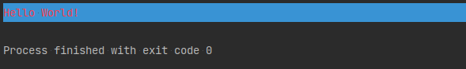
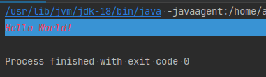
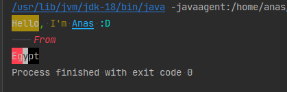

## JColorfulConsole

### JColorfulConsole is a console color library.
[](https://jitpack.io/#Anas-Elgarhy/JColorfulConsole)

### Features:
 - Support text color.
 - Support background color.
 - Support text style.

### How to add this library into your project
**Step 1**. Add the dependency
```xml
<dependency>
    <groupId>com.anas.jcolorfulconsole</groupId>
    <artifactId>jcolorfulconsole</artifactId>
    <version>0.1.4</version>
</dependency>
```
**Step 2**. run this command `mvn install`

#### Gradle:
**Step 1**. Add the JitPack repository to your build file<br>
*Add it in your root build.gradle at the end of repositories:*
```gradle
allprojects {
    repositories {
        ...
        maven { url 'https://jitpack.io' }
    }
}
```
**Step 2**. Add the dependency
```gradle
	dependencies {
	        implementation 'com.github.Anas-Elgarhy:JColorfulConsole:0.1.4'
	}
```

### Usage:
```java
ConsoleManager manager = new DefaultConsoleManager(); // Create a new console manager
manager.setTextColor(TextColor.LIGHT_RED); // Set text color
manager.setBackgroundColor(BackgroundColor.DARK_BLUE); // Set background color
   
manager.println("Hello World!"); // Print text
```


```java
ConsoleManager manager = new DefaultConsoleManager(); // Create a new console manager
manager.setTextColor(TextColor.LIGHT_RED); // Set text color
manager.setBackgroundColor(BackgroundColor.DARK_BLUE); // Set background color
manager.setTextStyle(TextStyle.ITALIC); // Set text style

manager.println("Hello World!"); // Print text
```


```java
public class Example1 {
    public static void main(String[] args) {
        ConsoleManager manager = new DefaultConsoleManager();

        manager.print("Hello", BackgroundColor.DARK_YELLOW, TextColor.DARK_WHITE, TextStyle.BOLD, TextStyle.ITALIC);
        manager.print(", ", TextColor.LIGHT_GREEN);
        manager.print("I'm ", TextColor.DARK_YELLOW);
        manager.print("Anas", TextColor.LIGHT_BLUE, TextStyle.DOUBLE_UNDERLINE);
        manager.println(" :D", TextColor.LIGHT_CYAN);
        manager.println("\tFrom", TextColor.LIGHT_RED, TextStyle.ITALIC);
        manager.print("Eg", BackgroundColor.LIGHT_RED);
        manager.print("y", BackgroundColor.DARK_WHITE);
        manager.print("pt", BackgroundColor.DARK_BLACK);
    }
}
```


#### License: MIT